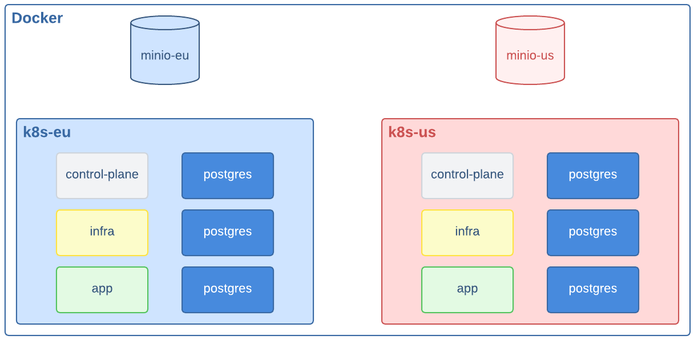

[](https://cloudnative-pg.io/)

# Local Learning Environment for CloudNativePG

Welcome to **`cnpg-playground`**, a local learning environment designed for
learning and experimenting with CloudNativePG using Docker and Kind.

## Prerequisites

Ensure you have the latest available versions of the following tools installed
on a Unix-based system:

- [Docker](https://www.docker.com/)
- [Git](https://git-scm.com/)
- [Kubectl](https://kubernetes.io/docs/tasks/tools/)
- [The `cnpg` plugin for `kubectl`](https://cloudnative-pg.io/documentation/current/kubectl-plugin/)
- [Kind](https://kind.sigs.k8s.io/)

You don’t need superuser privileges to run the scripts, but elevated
permissions may be required to install the prerequisites.

### Additional Tools

For an improved experience with the CNPG Playground, it’s recommended to
install the following tools:

- **[`curl`](https://curl.se/)**: Command-line tool for data transfer.
- **[`jq`](https://jqlang.github.io/jq/)**: JSON processor for handling API
  outputs.
- **[`stern`](https://github.com/stern/stern)**: Multi-pod log tailing tool.
- **[`kubectx`](https://github.com/ahmetb/kubectx)**: Kubernetes context
  switcher.

Recommended `kubectl` plugins:

- **[`view-secret`](https://github.com/elsesiy/kubectl-view-secret)**: Decodes
  Kubernetes secrets.
- **[`view-cert`](https://github.com/lmolas/kubectl-view-cert)**: Inspects TLS
  certificates.

These tools streamline working with the CNPG Playground.

## Local Environment Overview

This environment emulates a two-region infrastructure (EU and US), with each
region containing:

- An object storage service powered by [MinIO](https://min.io/) containers
- A Kubernetes cluster, deployed using [Kind](https://kind.sigs.k8s.io/),
  consisting of:

    - One control plane node
    - One node for infrastructure components
    - One node for applications
    - Three nodes dedicated to PostgreSQL

The architecture is illustrated in the diagram below:



## Usage

This playground environment is managed by three main scripts located in the
`/scripts` directory.

| Script       | Description                                                  |
| :----------- | :----------------------------------------------------------- |
| `setup.sh`   | Creates and configures the multi-region Kubernetes clusters. |
| `info.sh`    | Displays status and access information for active clusters.  |
| `teardown.sh`| Removes clusters and all associated resources.               |

### Setting Up the Learning Environment

The `setup.sh` script provisions the entire environment. By default, it creates
two regional clusters: `eu` and `us`.

```bash
# Create the default two-region environment (eu, us)
./scripts/setup.sh
```

You can easily customize this by providing your own list of region names as
arguments.

```bash
# Create a custom environment with 'it' and 'de' regions, simulating Italy and Germany
./scripts/setup.sh it de

# Create a single-region environment
./scripts/setup.sh local
```

### Connecting to the Kubernetes Clusters

To configure and interact with both Kubernetes clusters during the learning
process, you will need to connect to them. After setup, you can run the
`info.sh` script at any time to see the status of your environment.

It automatically detects all running playground clusters and displays their
access instructions, and node status.

```bash
./scripts/info.sh
```

### Inspecting Nodes in a Kubernetes Cluster

To inspect the nodes in a Kubernetes cluster, you can use the following
command:

```bash
kubectl get nodes
```

For example, when connected to the `k8s-eu` cluster, this command will display
output similar to:

```console
NAME                   STATUS   ROLES           AGE     VERSION
k8s-eu-control-plane   Ready    control-plane   10m     v1.34.0
k8s-eu-worker          Ready    infra           9m58s   v1.34.0
k8s-eu-worker2         Ready    app             9m58s   v1.34.0
k8s-eu-worker3         Ready    postgres        9m58s   v1.34.0
k8s-eu-worker4         Ready    postgres        9m58s   v1.34.0
k8s-eu-worker5         Ready    postgres        9m58s   v1.34.0
```

In this example:
- The control plane node (`k8s-eu-control-plane`) manages the cluster.
- Worker nodes have different roles, such as `infra` for infrastructure, `app`
  for application workloads, and `postgres` for PostgreSQL databases. Each node
  runs Kubernetes version `v1.34.0`.

### Cleaning Up the Environment

When you're finished, the `teardown.sh` script can remove the resources. It can
be run in two ways:

#### Full Cleanup

Running the script with no arguments will auto-detect and remove all playground
clusters and their resources, returning your system to its initial state.

```bash
# Destroy all created regions
./scripts/teardown.sh
```

#### Selective Cleanup

You can also remove specific clusters by passing the region names as arguments.

```bash
# Destroy only the 'it' cluster
./scripts/teardown.sh it
```

## Demonstration with CNPG Playground

The **CNPG Playground** offers a great environment for exploring the
**CloudNativePG operator** and the broader concept of running PostgreSQL on
Kubernetes.
It allows you to create custom scenarios and demo environments with ease.

To help you get started, we've included a demo scenario that showcases the
[**distributed topology** feature](https://cloudnative-pg.io/documentation/current/replica_cluster/).
This walkthrough guides you through deploying a **PostgreSQL cluster
distributed across two regions** within the playground. The symmetric
architecture also includes **continuous backup** using the
[Barman Cloud Plugin](https://cloudnative-pg.io/plugin-barman-cloud/).

For complete instructions and supporting resources, refer to the
[demo folder](./demo/README.md).

## Installing CloudNativePG on the Control Plane

If you plan to use the CNPG Playground without the demo mentioned earlier,
you’ll need to install CloudNativePG manually.

To install the latest stable version of the CloudNativePG operator on the
control plane nodes in both Kubernetes clusters, execute the following
commands:

```bash
for region in eu us; do
   kubectl cnpg install generate --control-plane | \
      kubectl --context kind-k8s-${region} apply -f - --server-side

   kubectl --context kind-k8s-${region} rollout status deployment \
      -n cnpg-system cnpg-controller-manager
done
```

These commands will deploy the CloudNativePG operator with server-side apply on
both the `kind-k8s-eu` and `kind-k8s-us` clusters.

Ensure that you have the latest version of the `cnpg` plugin installed on your
local machine.

## Contrib Directory

The [`contrib`](./contrib/) directory contains a collection of optional
components that extend the playground environment. One example is the
monitoring setup based on Prometheus and Grafana, available in the
[`contrib/monitoring`](./contrib/monitoring/) subdirectory.
Each contribution includes its own `README.md` file, providing an explanation
of its purpose and clear instructions on how to deploy and configure the
additional resources.

## Nix Flakes

Do you use Nix flakes? If you do, this package have a configured
dev shell that can be used with:

```
nix develop .
```

## Using Linux or WSL2

You may need:

```
sudo sysctl fs.inotify.max_user_watches=524288
sudo sysctl fs.inotify.max_user_instances=512
```

More information in the [relative ticket comment](https://github.com/kubernetes-sigs/kind/issues/3423#issuecomment-1872074526).

## Using Rancher Desktop

You may need to follow the instructions [in the Rancher Desktop
Guide](https://docs.rancherdesktop.io/how-to-guides/increasing-open-file-limit/)
to increase the open file limit.

```
provision:
- mode: system
  script: |
    #!/bin/sh
    cat <<'EOF' > /etc/security/limits.d/rancher-desktop.conf
    * soft     nofile         82920
    * hard     nofile         82920
    EOF
    sysctl -w vm.max_map_count=262144
    sysctl fs.inotify.max_user_watches=524288
    sysctl fs.inotify.max_user_instances=512
```
